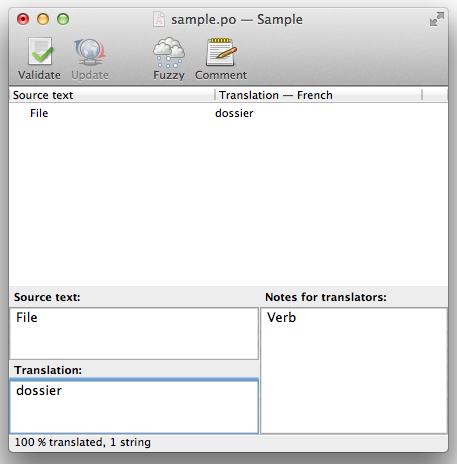

# Using the `translate` directive

Strings are marked as translatable using the `translate` directive. Here's a simple example:

```xml
<h1 translate>Hello!</h1>
```

This div will automatically be translated using the translated strings (which we'll define later on). For instance, in Dutch, it might read `Hallo!`.

## Plurals

Plural strings can be annotated using two extra attributes: `translate-n` and `translate-plural`:

```xml
<div translate translate-n="count" translate-plural="{{count}} boats">One boat</div>
```

The general format is:

```xml
<div translate translate-n="COUNTEXPR" translate-plural="PLURALSTR">SINGULARSTR</div>
```

Depending on the value of `COUNTEXPR`, either the singular string or the plural string will be selected.

Inside the strings, you can use any variable that is available in the scope. In the example above we are using the `{{count}}` expression, which is also used as the value of the `translate-n` attribute. It doesn't have to be like this: you can use any variable that's available.

The `translate-n` attribute accepts any valid Angular.JS expression, even functions.

## Interpolation

Full interpolation support is available in translated strings, so the following will work as expected:

```xml
<div translate>Hello {{name}}!</div>
```

## Attributes

Sometimes it's not an option to use an attribute (e.g. when you want to annotate an attribute value). There's a `translate` filter available for this purpose.

```xml
<input type="text" placeholder="{{'Username'|translate}}" />
```

This filter does not support plural strings.

## Comments

Comments can be added to the catalog to help translators with the context of the translatable string.

You can use the `translate-comment` directive to add context comments.

A simple example:

```xml
<h1 translate-comment="Verb" translate>File</h1>
```
In the above example, the comment will help translator to treat the string, "File", as a verb.

The comments will appear in the catalog.

E.g. in [poedit](http://poedit.net/) application, the comment will appear under "Notes for translators" section.



<a href="/dev-guide/extract/" class="btn btn-primary">Next: Extracting strings</a>
