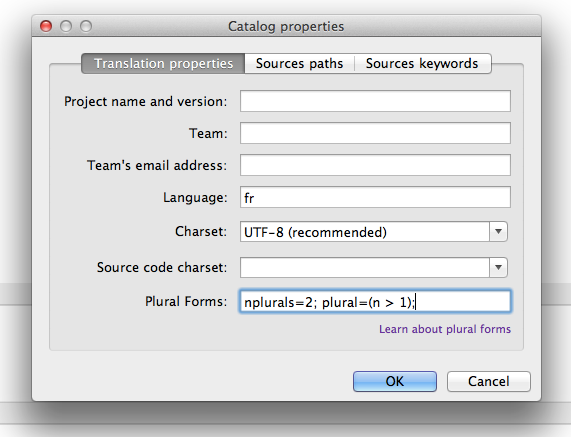

# Translate strings

There is a wide range of translation tools available in the gettext ecosystem. Some of the are listed on [Wikipedia](http://en.wikipedia.org/wiki/Gettext#See_also). The general workflow is always the same:

1. Use the `.pot` template as the basis for translation. This will generate a new translation catalog (a `.po` file) or updates an existing `.po` file.
2. Translate the strings (and plural forms) in your corresponding language.
3. Save the resulting `.po` file for the next step.

Some gettext translation tools will also generate compiled `.mo` files. You can safely ignore these, we won't be using them.

## Transifex

By far the easiest option to translate is [Transifex](https://www.transifex.com/). This online service lets you get started quickly and does not require you (or your translators) to install anything. This service is not free, but there are free plans available for open-source projects.

## Pootle

An alternative to Transifex is [Pootle](http://pootle.translatehouse.org/), a web interface for translations. Pootle can be rather difficult to setup though.

## Poedit

The [poedit](http://www.poedit.net/) application should be installed on your desktop, but is very easy to use (with one small exception). Here's a step by step guide:

1. Download and install Poedit, which is available for Windows, Linux and Mac OS X.
2. Start Poedit and choose the "New Catalog from POT File..."

   
   
3. Locate your `.pot` file. This will open the "Catalog properties" dialog. Most of these options can be ignored, except for the Language and Plural Forms fields:

   
   
   You can find the correct value for these fields on [this page](http://docs.translatehouse.org/projects/localization-guide/en/latest/l10n/pluralforms.html?id=l10n/pluralforms).
   
4. TODO

<a href="/dev-guide/compile/" class="btn btn-primary">Next: Compiling your translations</a>
